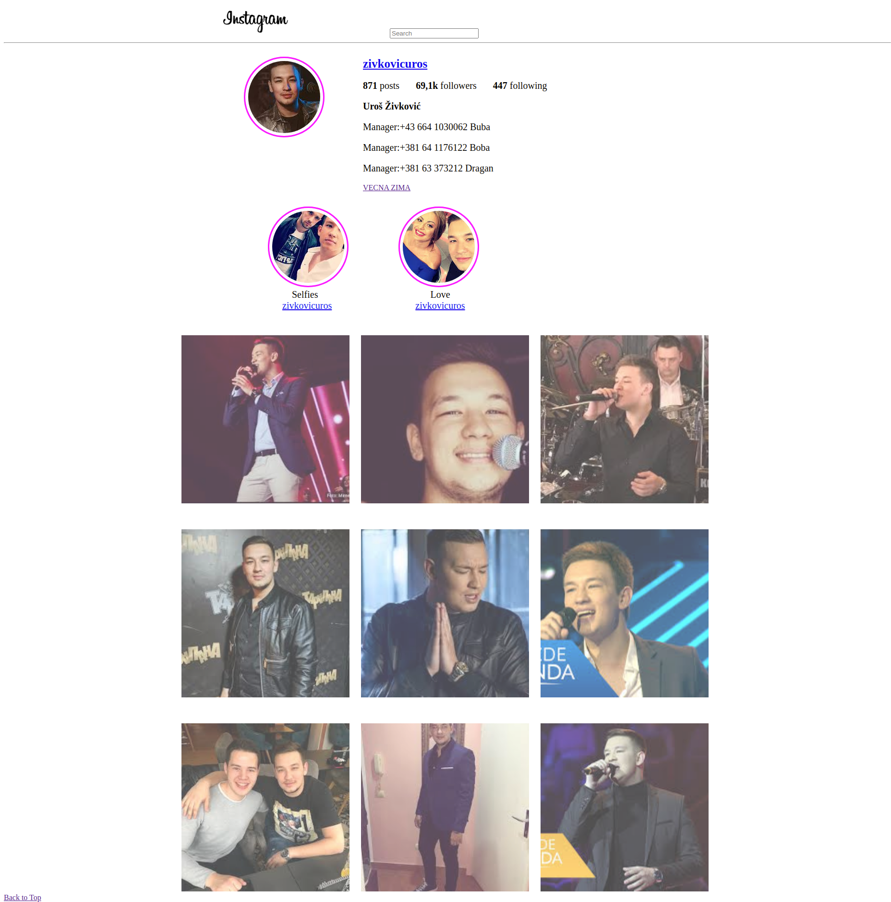

Extra-Exercise: Social Network User Page
Recreate a User Page similar to Instagram. E.g: https://images.ctfassets.net/pt9zoi1ijm0e/jEVniQHW7wHNvTQl3LRGw/180e975d4b641390fcfdf946e1f4afa2/Instagram_Profile_Homepage_Screenshot.png
It doesn't necessarily have to be the same layout and position of elements. Just make sure to include:

- a rounded profile pic (of yourself or your dog/cat or whatever you want)
- a username in bold
- a short bio
- a link to your github
- 2/3 "stories" rounded pictures with borders like in the image above. Choose whatever pics you want. When you hover on them, they should become a bit bigger and the border should become black. If you click on them, you should be redirected to a wikipedia page about that topic,
- 3 or 6 or 9 squared pictures in a grid-like structure (See instagram picture above).
  Those pictures should be slightly transparent. When you hover on one, it should become fully opaque.
  Optional: Choose 1/2 of those pictures and wrap them in a hyperlink element. When clicking on them, the user should be redirected to a new page
  that contains the image the you just clicked on. The image should be placed in the center of the screen. Underneath the image, place (in a paragraph) the text that you used in the main page in the alt-attribute.
  Notes:
  Make sure to specify width/height and alt on your images.
  Feel like or need to compress/resize images? Experiment with https://imagemagick.org/
  Experiment with float to align some elements.
  Have questions? Ask on this thread please, so other ppl can read the answer :)
  Additional content for the Optional part:
  right before the paragraph place your username in bold. When clicking on the username, you should be redirected to your user-page
