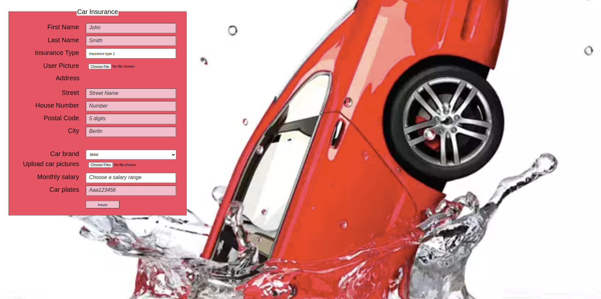

Add the following inputs to the form:

- first name: required, max 30
- last name: required, max 50
- insurance type: for now not editable, use the value "insurace type 1". This input shall be sent with the form data
- user picture: optional, max 1 image (can be any image format)
- address: required, max 150
- house number: required, min 1, max 300
- postal code, required
- city, required
  Add the following suggestions for the user: Berlin, Hamburg, Leipzig, Stuttgart, Horb am Neckar, Cottbus, Tübingen, {{3 other cities of your choice}}
- Car brand: required.
  The user must select 1 out of 13 car brands of your choice.
  the API to call is: POST /submit-information

Optional: more inputs

- a few pictures of the car: only jpeg's allowed (mind that there could be more jpeg extensions
- monthly salary in Euro: allow the user to choose a range
  Options are: 0, 0 - 1000, 1000 - 3000, 3000 - 5000, 5000 - 7000, 7000 - 10000, 10000+
- car plates: required. Look for a pattern to match 3 letters (lowercase or uppercase) and 6 numbers
- the car brand used above, group the brands by country (select brands belonging to at least 3 countries)
  Optional: styling

1. using inline-block, align the inputs to start from the same position
2. align the submit button with the inputs
3. give the legend a light green background and place it on top / middle of the form (without using absolute)
4. all text inputs that have a maxlength attribute, when focused must have a border of 5px black (7px radius)
5. invalid forms must have no red border or outline, but have a light orange background
6. Assign a descriptive placeholder to text inputs and color the placeholder in dark grey italic

